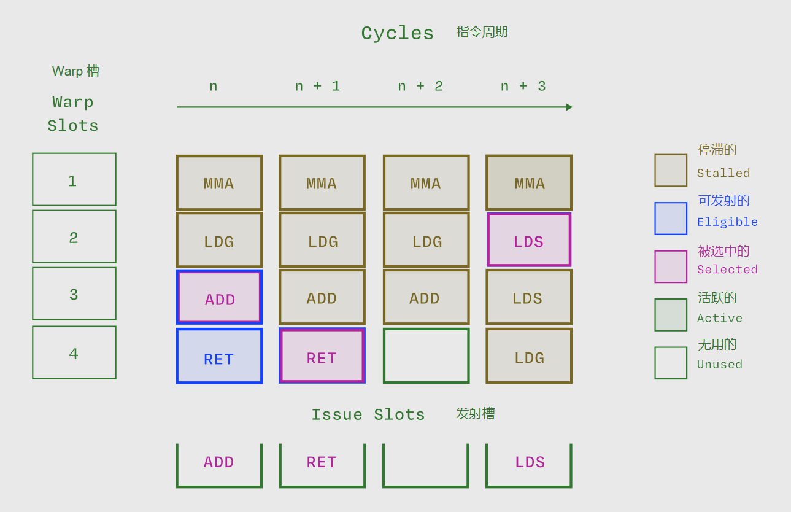

# Warp 执行状态 （Warp Execution State）

## Warp 状态：Active、Stalled、Eligible、Selected

在运行一个 kernel（内核） 时，GPU 中的 warp 状态可用几个 **非互斥（non-exclusive）** 的形容词来描述：

- active（活跃的）
- stalled（停滞的）
- eligible（可发射的）
- selected（被选中的）

## Active Warp（活跃的 warp）

一个 warp 从其中的线程开始执行起，到所有线程退出内核为止，都被视为 活跃的（active）。

所有活跃的 warps 构成了 warp 调度器（warp scheduler）每个周期挑选候选 warp 以发射指令（issue slots） 的池。

每个 Streaming Multiprocessor（SM，流式多处理器） 所能同时保持的活跃 warps 数量取决于 GPU 架构。
这一上限可在 NVIDIA 的 计算能力（Compute Capability） 文档中查到。\
例如：在一块 H100 SXM GPU（Compute Capability 9.0） 上，每个 SM 最多可同时拥有 64 个活跃 warp（共 2048 个线程）。

需要注意的是：
- “活跃”并不意味着 warp 正在执行指令。
- 即使在大多数周期内都有活跃 warp 存在，也不代表所有执行单元都在工作。
- 图示中除了一个 slot+cycle 外，其他周期都存在活跃 warp——这意味着 occupancy（占用率） 很高。

## Eligible Warp（可发射的 warp）

可发射 warp（eligible warp） 是指那些已经准备好执行下一条指令的活跃 warp。

一个 warp 若要成为 eligible，必须满足以下条件：\
1. 下一条指令已经被取指（fetched）；
2. 所需的执行单元（execution unit）当前可用；
3. 所有指令依赖（dependencies）均已解析完成；
4. 没有同步屏障（synchronization barrier）阻止执行。

这些 eligible warps 构成了 warp 调度器在当前周期中可立即选择发射的候选。

在图示中，几乎所有周期（除第 n + 2 周期外）都出现了 eligible warps。

如果许多周期里都没有 eligible warp，则性能会明显下降——
特别是在主要使用延迟较短的算术单元（如 CUDA Cores）时。

## Stalled Warp（停滞的 warp）

停滞 warp（stalled warp） 是指那些因为依赖未解决或资源冲突而无法发射下一条指令的活跃 warp。

warp 停滞的常见原因包括：
1. 执行依赖（execution dependencies）：必须等待前一条算术指令的结果；
2. 内存依赖（memory dependencies）：必须等待前一条内存操作的返回结果；
3. 流水线冲突（pipeline conflicts）：所需执行资源当前被其他 warp 占用。

当 warp 因访问共享内存（shared memory）或执行耗时较长的算术操作而停滞时，称其为 “短记分牌（short scoreboard）”停滞。

当 warp 因访问 GPU RAM 而停滞时，则称其为 “长记分牌（long scoreboard）”停滞。

这些 scoreboard（记分牌） 是 warp 调度器内部用于追踪依赖关系的硬件模块。

记分牌调度（scoreboarding）是一种源自早期超级计算机的动态指令调度技术，最早出现在 CDC 6600（世界上第一台超级计算机） 上。

与 CPU 不同，GPU 的 scoreboarding 不会在同一线程内实现乱序执行（instruction-level parallelism），
它仅用于跨线程的并行调度（thread-level parallelism）。

在图示中，stalled warps 在每个周期的多个 slot 上都会出现。

停滞 warp 并不一定是坏事 ——
有时，为了隐藏长时延操作（如内存加载或 Tensor Core 指令 HMMA 等）的延迟，
系统中同时存在大量停滞的 warp 是必要的。

## Selected Warp（被选中的 warp）

被选中的 warp（selected warp） 是指在当前周期内，被调度器从 eligible warps 池中选出并获得一次指令发射机会的 warp。

每个周期，warp 调度器会：
1. 检查所有 eligible warps；
2. 若存在可用者，则选中一个并发射指令。

在每个有 eligible warp 的周期，都会有一个 selected warp。
而在活跃周期中，warp 被选中并成功发射指令的比例称为：发射效率（issue efficiency）。