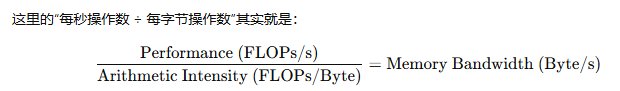

# 屋顶线模型（Roofline Model）

屋顶线模型是一种简化的、可视化的性能模型，用于快速判断一个程序的性能是受限于内存带宽（memory bandwidth）还是算术带宽（arithmetic bandwidth）。

在屋顶线模型中，来自硬件的两个“屋顶（roof）”为程序的可能性能设定了上限（即“天花板”）：
1. 计算屋顶（compute roof）：目标硬件（如 CUDA Core 或 Tensor Core）的峰值计算速率（peak rate），也称为算术带宽（arithmetic bandwidth）；
2. 内存屋顶（memory roof）：目标硬件的峰值内存吞吐量（peak memory throughput），也称为内存带宽（memory bandwidth）。

- 横轴（x 轴）：算术强度，每字节数据执行多少次浮点运算，FLOPs / Byte。

- 纵轴（y 轴）：性能，每秒浮点运算次数，FLOPs / s。

- 计算屋顶 是一条 **水平线**，其 高度 = 算术带宽，计算硬件能处理多少运算（单位：FLOPS）；

- 内存屋顶 是一条 **斜线** ，其 斜率 = 内存带宽，系统能传输多少数据（单位：Bytes/s）。

- 脊点，其横坐标表示 **摆脱内存瓶颈** 所需的 **最小算术强度**

- 一个特定 kernel 的横坐标可以立刻告诉你它是瓶颈：
    - 计算受限（compute-bound）（点位于水平屋顶下方）
    - 内存受限（memory-bound）（点位于斜线下方）。

- 由于存在各种开销（overhead），kernel 的实际性能很少真正触及这两条屋顶线。

- Tensor Core 和 Cuda Core 要单独构建 Roofline 模型，因为 Tensor Core 的 FLOPS 明显高于 CUDA Core

# 其他

系统延迟（latency）在图中完全没有体现，模型只考虑带宽和吞吐量。

- 延迟，从发起任务到得到结果的时间\
    （单辆车从进入车道到通过的时间，如 单车通过时间 = 5秒，延迟 = 5秒）
- 带宽，硬件能支持的吞吐量上限\
    （带宽 = 速度 × 容量，车道同时能承载多少车 × 车道的速度，如 车道容量 = 3 辆，单车通过时间 = 5 秒， 则 带宽 = 3 * 1/5 = 0.6辆/秒）
- 吞吐量， 单位时间完成多少工作\
    （一段时间内通过车道的总车辆数，如 车道容量 = 3 辆， 只进入了2 辆车，车通过时间 = 5 秒， 则 带宽 = 2 * 1/5 = 0.4辆/秒）

屋顶线模型有意忽略复杂因素（比如延迟、调度开销等），只关注带宽和吞吐量。理解这些假设及其逻辑，是正确使用屋顶线模型、判断它能力和适用范围的关键。

（即，你可以用该模型判断高速公路瓶颈，它只告诉你“整体速度快不快”，而不是“单辆车多久能通过”。）

屋顶线模型最早由 Samuel Williams、Andrew Waterman 和 David Patterson 于 2008 年提出。
他们的研究基于几项重要的硬件发展趋势，这些趋势在模型提出前后都深刻影响了计算机体系结构的发展：

- 延迟滞后于带宽。系统的单次响应速度提升有限，但整体吞吐量提升非常快。
- 内存墙。计算子系统（例如处理器核心）的性能增长速度远快于内存子系统（如缓存与 DRAM），导致性能受限于内存性能。

