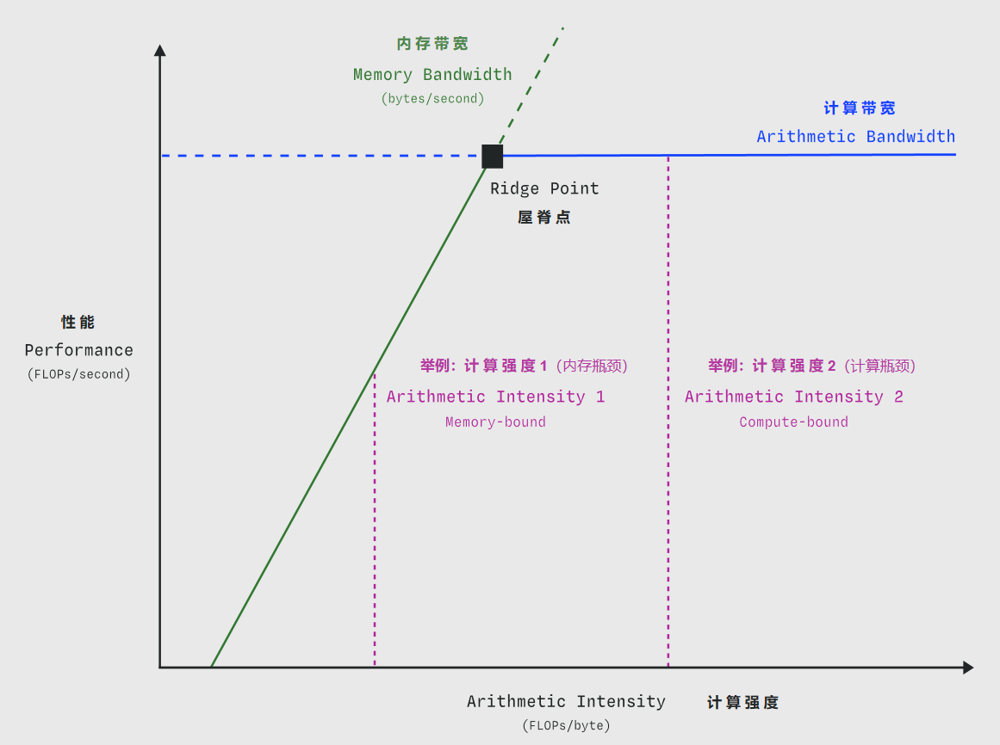

# 内存瓶颈（Memory-bound）

内存受限（memory-bound） 的 Kernel 受到 GPU 显存（GPU RAM） 与 流式多处理器（Streaming Multiprocessors, SM）本地缓存 之间带宽的限制。

因为，对于 GPU 性能分析中常见的问题而言，其工作集大小（working set size） 通常远远大于 GPU 存储层次结构中任何更高层级（如缓存、寄存器）的容量。

内存受限 的 Kernel 具有较低的 算术强度（arithmetic intensity） ，也就是说，每传输一个字节执行的算术运算较少。

在 屋顶线模型（roofline model） 的“脊点”（ridge point）而言，它处于更低的区域。

## 举例：大型模型推理

在当今的 大型语言模型（LLM）推理任务 中，模型在 解码/输出生成阶段（decode/output generation stage） 通常是内存受限的。

因为此时每次前向传播（forward pass）都必须重新加载权重。（这里指的加载权重是将 权重参数 从 GPU 显存或更慢的系统内存 到 计算单元。SM cache / shared memory 容量太小，根本放不下几十 GB 的权重）

（这里不包括使用了多 token 预测（multi-token prediction） 或 推测式解码（speculative decoding））

### 简单计算例子

问题：
- 内存受限 Transformer 大语言模型 的最小 token 间延迟（inter-token latency，即每个输出 token 所需的最短时间）。

模型和硬件信息：
- 假设模型有 5000 亿个参数（500B parameters），以 16 位精度 存储，总大小约为 1 TB。
- 在一张显存带宽为 10 TB/s 的 GPU 上运行推理。

计算过程：
- 加载所有权重需要 100ms（参数大小 / 带宽 = 1TB / 10TB/s = 0.1s = 100ms）
- 即理论上在内存受限的情况下（假设计算带宽等都不是瓶颈），每个 batch 元素生成一个 token 的 最小延迟 就是 100 毫秒。

- 这意味着受 硬件内存带宽影响，你的 token 延迟最低也需要 100 毫秒。

如何降低内存瓶颈（提高计算强度）
- 通过将多个输入一起批处理（batching multiple inputs together），可以线性地增加每个加载参数所执行的浮点运算次数（即算术强度），理论上直到达到计算受限（compute-boundedness）的点，并且不会增加额外延迟。

- 这意味着模型的 **吞吐量（throughput）** 会随着 batch size 线性提升。